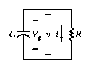

# Análise de Circuitos Elétricos
## Aula 06 - Circuitos de Primeira Ordem
 
Prof. M.Sc. Diego Ascânio Santos (ascanio@cefetmg.br)

Aula baseada sobre o material do professor Dr. Emerson Gonçalves de Melo (emerdemelo@usp.br - DEMAR EEL USP), da professora Drª. Thabatta Moreira Alves de Araújo (thabatta@cefetmg.br - DIGDDV) e da Khan Academy.

CEFET-MG DIGDDV - Divinópolis, 2023.

---

## Roteiro

1. Definição
2. Estados Permanentes e Estados Transitórios
3. Estímulo Natural
4. Estímulo Degrau
5. Resposta Natural do Circuito RC
6. Resposta Natural do Circuito RL
7. Resposta ao Degrau do Circuito RC
8. Resposta ao Degrau do Circuito RL
9. Solução Geral Para Respostas a um Degrau e Natural

---

## DEFINIÇÃO

Circuitos de primeira ordem são circuitos que possuem apenas um elemento (capacitor ou indutor) de armazenamento de energia em série a um elemento resistivo (resistor).

Até o momento, conhecemos somente as grandezas presentes em um acumulador de energia (tensão, corrente, potência e energia) mas, não entendemos os processos que determinam como tais elementos acumulam ou fornecem energia.

Para isso, precisamos definir os conceitos de estados transitórios e permanentes, o conceito de estímulos (natural e degrau) e introduzir as respostas de capacitores e indutores a tais estímulos.

---

## Estados Permanentes e Estados Transitórios

### Estado Permanente

<!-- _class: lead -->
Considere um acumulador passivo de energia (Capacitor ou Indutor). O estado permanente refere-se às condições (valores de tensão, corrente, potência e/ou energia) deste acumulador após um período suficientemente longo, durante o qual perturbações ou mudanças imprevistas já cessaram.

### Exemplos de estados permanentes:

<!-- _class: lead -->
1. Capacitores se comportarem como malhas abertas em circuitos CC (após terem sido carregados acumulando energia na forma de campo elétrico);
2. Indutores se comportarem como curtos-circuitos em circuitos CC (após terem sido carregados acumulando energia na forma de campo magnético);
3. Capacitores e Indutores descarregados e desconectados de qualquer fonte de energia;

---

## Estados Permanentes e Estados Transitórios

### Estados Transitórios

Referem-se às condições dos passivos de energia enquanto acumulam ou fornecem energia de forma transitoria. Estes estados surgem de perturbações que interrompem o estado permanente pré-existente do sistema.

Estamos interessados em modelar o comportamento transitório dos passivos de energia em circuitos de primeira ordem \\(RL \text{ | } RC\\). Por serem circuitos de 1ª ordem, é possível modelar estes circuitos através de equações diferenciais de ordem 1. porém, antes de modelar os circuitos, temos de entender que a transitoriedade so existe em resposta a um estímulo que causa uma perturbação a um sistema que até um instante de tempo \\( T = 0 \\) se encontrava em um estado permanente.

A priori, estudaremos dois destes estímulos:

1. Natural
2. Degrau

---

## Estímulo Natural (Representa a Descarga)

- Representa perturbações que levam um passivo de energia a fornecer (descarregar) energia para um passivo de resistência.
- Queremos saber como o passivo de energia descarrega, modelando sua resposta natural.
- O estímulo natural é causado pela retirada repentina de uma fonte constante de tensão (corrente) conectada ao passivo de energia e pela ligação (imediata) deste passivo à uma carga resistiva.

- Exemplo de perturbação que leva um capacitor a descarregar: Um circuito onde a chave seletora estava a longo tempo na posição \\(a\\) e então, comuta para a posição \\(b\\) quando \\(t = 0\\).

<!-- _class: transparent -->

---

## Estímulo Degrau (Representa a Carga)

- Representa perturbações causadas por uma fonte constante e contínua de tensão (corrente) que levam um passivo de energia a acumular (carregar) energia em si.
- Se queremos saber como um passivo de energia carrega, modelamos sua resposta ao degrau.
- O estímulo ao degrau representa a aplicação repentina de uma fonte de tensão (corrente) constante a um acumulador de energia (novamente, capacitor ou indutor).

- Exemplo de perturbação que leva um capacitor a carregar: Um circuito onde a chave estava a longo tempo desligada e no instante \\(t = 0\\) é ligada, fazendo com que uma fonte de corrente constante seja conectada ao capacitor.

<!-- _class: transparent -->

---

## Resposta Natural do Circuito RC

- Uma vez que em \\(t = 0\\) a chave comuta de \\(a\\) para \\(b\\), logo, o capacitor \\(C\\) fica conectado, fornecendo energia, à resistência \\(R\\) como visto na segunda imagem à direita.
- Estamos interessados em aprender como o capacitor se comporta em resposta ao estímulo natural, ou seja, queremos saber como o capacitor descarrega.
- Existe algum modelo matemático que descreva este comportamento?
    - Sim, existe e este modelo será estudado agora!

<!-- _class: transparent -->

<!-- _class: transparent -->

---

## Resposta Natural do Circuito RC

<strong>Construção do modelo da descarga — RESPOSTA NATURAL — de um Capacitor</strong>

Considere o circuito RC equivalente à configuração do sistema quando \\(t = 0\\) (segunda imagem a direita). Como podemos observar, no nó \\(A\\) deste circuito, existem duas correntes que saem dele: 

1. Corrente de deslocamento \\(I_{C}\\) do capacitor, ocasionada pela variação da diferença de potencial do capacitor causada pela sua descarga;
2. Corrente elétrica \\(I_{R}\\) que passa pelo resistor, oriunda da diferença de potencial \\(V_{g}\\) presente nos terminais do capacitor \\(C\\).

Em seguida, vemos que não entra nenhuma corrente no nó \\(A\\). Logo, pela Lei de Kirchoff das Correntes no nó \\(A\\), temos que:

\\[
0 = I_{C} + I_{R}
\\]

<!-- _class: transparent -->

<!-- _class: transparent -->

---

## Resposta Natural do Circuito RC

<strong>Construção do modelo da descarga — RESPOSTA NATURAL — de um Capacitor</strong>

Reiterando, sabemos pela Lei de Kirchoff das Correntes no nó \\(A\\), que: \\(0 = I_{C} + I_{R}\\).

Sabemos que \\(I_{R} = {V \over R}\\) e \\(I_{C} = C {{dV} \over {dt}}\\). Logo: 

\\[{C {{dV} \over {dt}}} + {V \over R} = 0 \rightarrow {C {{dV} \over {dt}}} = - {V \over R}\\]

Multiplicando ambos os lados da equação por \\({{dt} \over {VC}}\\), integrando ambos os lados de \\(t_{0}\\) a \\(t\\) (considerando que \\(t_{0} = 0\\)) e cientes que \\(ln(a) - ln(b) = ln({a \over b})\\), temos uma equação diferencial de primeira ordem homogênea e separável:

\\[
\begin{align}
{{dV} \over {V}} &= - {{dt} \over {RC}} \rightarrow \\\\
\int_{V(0)}^{V(t)} {{dV} \over {V}} &= \int_{0}^{t}{- {{dt} \over {RC}}} \rightarrow \\\\
ln(V(t)) - ln (V(0)) &= {{-t} \over {RC}} - 0 \rightarrow \\\\
ln({{V(t)} \over {V(0)}}) &= {{-t} \over {RC}}
\end{align}
\\]

Colocando ambos os lados da equação como expoentes de \\(e\\):

\\[
\begin{align}
{{V(t)} \over {V(0)}} &= e^{{{-t} \over {RC}}} \rightarrow \\\\
V(t) &= V(0) \cdot e^{{{-t} \over {RC}}}
\end{align}
\\]

<!-- _class: transparent -->

<!-- _class: transparent -->

---

## Resposta Natural do Circuito RC

<strong>Construção do modelo da descarga — RESPOSTA NATURAL — de um Capacitor</strong>

Como resolvemos a EDO e encontramos a equação que rege a tensão de um capacitor, a partir da lei de Ohm conseguimos encontrar as demais grandezas do sistema, como a corrente \\(I_{R}\\) que passa pelo resistor \\(R\\), a potência \\(p\\) dissipada em \\(R\\) (fornecida pelo capacitor \\(C\\)) e a energia \\(w\\) consumida pelo resistor \\(R\\) (fornecida pelo capacitor \\(C\\)\):

\\[
\begin{align}
    i(t) &= {{v(t)} \over {R}} = {{V(0)} \over {R}} e^{{{-t}\over{RC}}}, t \geq 0^{+}, \\\\
    p(t) &= Vi = {{V(0)^{2}} \over {R}} e^{{{-2t}\over{RC}}}, t \geq 0^{+}, \\\\ 
    w(t) &= \int_{0}^{t}{p dx} = \int_{0}^{t}{{{V(0)^{2}} \over {R}} e^{{{-2t}\over{RC}}} dx} \\\\
         &= {1 \over 2}C{V(0)}^{2}(1 - e ^ {{-2t} \over {RC}}), t \geq 0.
\end{align}
\\]

Nas funções exponencias presentes em todas as equações verificamos que existe um coeficiente \\(RC\\) associado a \\(t\\). Esse coeficiente é conhecido como constante de tempo \\(\tau\\) (tau) dos circuitos de primeira ordem e tal coeficiente determina o quão rápida (ou lenta) será a descarga do capacitor em uma configuração \\(RC\\).

<!-- _class: transparent -->

Gráfico da Tensão do Capacitor durante a resposta natural do circuito RC

<!-- _class: transparent -->

Gráfico da Corrente do Capacitor durante a resposta natural do circuito RC

<!-- _class: transparent -->

Gráfico da Potência fornecida pelo Capacitor durante a resposta natural do circuito RC ao longo do tempo

<!-- _class: transparent -->

Gráfico da Energia Consumida pelo Resistor durante a resposta natural do circuito RC ao longo do tempo

---

## Determinação da Resposta Natural de um Circuito RC
### Exemplo 7.3 Livro Nilsson e Riedel 10ª Edição

<iframe src="https://diegoascanio.github.io/jupyterlite/lab?path=exemplo-7.3.ipynb" width=100% height=100%></iframe> 

---

## Resposta Natural do Circuito RL

- Quando a chave é desconectada em \\(t = 0\\), ocorre uma variação na corrente, visto que a fonte de corrente \\(I_{S}\\) é desconectada do sistema.
- O circuito que durante \\(t < 0\\) correspondia à primeira imagem da direita, passa a corresponder à segunda quando \\(t \geq 0\\).
- O indutor que antes se comportava como um curto circuito no sistema e que estava previamente carregado — armazenando energia magnética — agora fará oposição (como esperado) à variação da corrente, produzindo (a partir da energia eletromagnética que armazenou) uma corrente elétrica que se opõe à variação de corrente causada pela desconexão de \\(I_{S}\\) em \\(t = 0\\).
- Cientes de que queremos entender como o indutor responde ao estímulo natural — como ele descarrega — vamos construir o modelo matemático para descrever tal resposta.

<!-- _class: transparent -->

<!-- _class: transparent -->

---

## Resposta Natural do Circuito RL

<strong>Construção do modelo da descarga — RESPOSTA NATURAL — de um Indutor</strong>

Considere o circuito \\(RL\\) equivalente à configuração do sistema quando \\(t = 0\\) (segunda imagem a direita). Pela lei de Kirchoff das Tensões nas Malhas, sabemos que a diferença de potencial do Indutor somada à diferença de potencial do resistor é igual a \\(0\\):

\\[
\begin{align}
V_{L} + V_{R} &= 0 \therefore \\\\
L {{di} \over {dt}} + Ri &= 0
\end{align}
\\]

Aplicando as manipulações algébricas necessárias — colocando o termo \\(RI\\) à direita da igualdade e multiplicando ambos os lados da equação por \\({{dt} \over {Li}}\\) — obtemos a seguinte EDO de 1ª Ordem:

\\[
{{di} \over {i}} = - {R \over L} dt
\\]

<!-- _class: transparent -->

<!-- _class: transparent -->

---

## Resposta Natural do Circuito RL

<strong>Construção do modelo da descarga — RESPOSTA NATURAL — de um Capacitor</strong>

Integrando ambos os lados da EDO \\({{di} \over {i}} = - {R \over L} dt\\) de \\(t_{0}\\) a \\(t\\) (considerando que \\(t_{0} = 0\\)) e cientes que \\(ln(a) - ln(b) = ln({a \over b})\\), temos:

\\[
\begin{align}
{{di} \over {i}} &= - {R \over L} dt \rightarrow \\\\
\int_{I(0)}^{I(t)} {{di} \over {i}} &= \int_{0}^{t}{- {R \over L} dt} \rightarrow \\\\
ln(I(t)) - ln (I(0)) &= - {R \over L} t - 0 \rightarrow \\\\
ln({{I(t)} \over {I(0)}}) &= - {R \over L} t \rightarrow
\end{align}
\\]

Colocando ambos os lados da equação como expoentes de \\(e\\):

\\[
\begin{align}
{{I(t)} \over {I(0)}} &= e^{- {R \over L} t} \rightarrow \\\\
I(t) &= I(0) e^{- {R \over L} t}
\end{align}
\\]

<!-- _class: transparent -->

<!-- _class: transparent -->

---

## Resposta Natural do Circuito RL

<strong>Construção do modelo da descarga — RESPOSTA NATURAL — de um Indutor</strong>

Como resolvemos a EDO e encontramos a equação que rege a corrente de um indutor, a partir da lei de Ohm conseguimos encontrar as demais grandezas do sistema, como a tensão \\(V_{R}\\) que passa pelo resistor \\(R\\), a potência \\(p\\) dissipada em \\(R\\) (fornecida pelo indutor \\(L\\)) e a energia \\(w\\) consumida pelo resistor \\(R\\) (fornecida pelo indutor \\(L\\)\):

\\[
\begin{align}
V_{R}(t) &= I(0) R e^{-{R \over L} t}, t \geq 0^{+}, \\\\
P(t) &= I(0)^2 R e^{-2{R \over L} t}, t \geq 0^{+}, \\\\
W(t) &= {1 \over 2} {L I(0)^2}(1 - e^{-2{R \over L} t}), t \geq 0^{+}
\end{align}
\\]

Nas funções exponencias presentes em todas as equações verificamos que existe um coeficiente \\({R \over L}\\) associado a \\(t\\). Esse coeficiente é conhecido como constante de tempo \\(\tau\\) (tau) dos circuitos de primeira ordem e tal coeficiente determina o quão rápida (ou lenta) será a descarga do indutor em uma configuração \\(RL\\).

<!-- _class: transparent -->

Gráfico da Corrente do Indutor durante a resposta natural do circuito RL

<!-- _class: transparent -->

Gráfico da Tensão do Resistor durante a resposta natural do circuito RL

<!-- _class: transparent -->

Gráfico da Potência fornecida pelo Indutor durante a resposta natural do circuito RL ao longo do tempo

<!-- _class: transparent -->

Gráfico da Energia Consumida pelo Resistor durante a resposta natural do circuito RL ao longo do tempo

---

## Determinação da Resposta Natural de um Circuito RL
### Exemplo 7.1 Livro Nilsson e Riedel 10ª Edição

<iframe src="https://diegoascanio.github.io/jupyterlite/lab?path=exemplo-7.1.ipynb" width=100% height=100%></iframe> 

---

## Resposta ao Degrau do Circuito RC

- Recapitulando: a resposta ao estímulo degrau (aplicação repentina de uma fonte de tensão / corrente) aos terminais de um passivo de armazenamento de energia representa a carga deste passivo.
- Uma vez que em \\(t = 0\\) a chave é ligada, logo, o capacitor \\(C\\) é conectado em paralelo ao equivalente de norton retratado, como visto na segunda imagem à direita.
- Estamos interessados em aprender como o capacitor se comporta em resposta ao estímulo degrau, ou seja, queremos saber como o capacitor carrega.
- Qual modelo matemático descreve este comportamento?
    - Será estudado agora!

<!-- _class: transparent -->

<!-- _class: transparent -->

---

## Resposta ao Degrau do Circuito RC

- Ao analisar o circuito quando \\(t = 0\\) vemos que existem três correntes:
    1. \\(I_{S}\\), corrente constante oriunda da fonte de corrente;
    2. \\(I_{R}\\), corrente presente no resistor;
    3. \\(I_{C}\\), corrente de deslocamento presente no capacitor.

- Pela LKC nos nós temos que:
\\[
    I_{S} = I_{R} + I_{C}
\\]

**Queremos encontrar uma equação que nos permita calcular a tensão armazenada pelo capacitor ao longo do tempo — \\(V_{C}(t)\\) — em função da corrente \\(I_{S}\\) fornecida pela fonte de corrente.**

Porquê? Porquê a tensão é a grandeza de interesse do capacitor, é aquela a qual este elemento apresenta oposição à sua variação.

<!-- _class: transparent -->

<!-- _class: transparent -->

---

## Resposta ao Degrau do Circuito RC

**Queremos encontrar uma equação que nos permita calcular a tensão armazenada pelo capacitor ao longo do tempo — \\(V_{C}(t)\\) — em função da corrente \\(I_{S}\\) fornecida pela fonte de corrente.**

- Pela LKC nos nós temos que:
\\[
    I_{S} = I_{R} + I_{C}
\\]

Sabemos que \\(I_{C} = C {{dV_{C}} \over {dt}}\\) e \\(I_{R} = {{V_{C}} \over R}\\). Logo:

\\[
C {{dV_{C}} \over {dt}} + {{V_{C}} \over R} = I_{S}
\\]

Pelo fato do termo a direita da EDO, \\(I_{S}\\), ser não nulo, estamos diante de uma EDO não-homogênea, que portanto, não pode ser resolvida com os métodos que abordamos até o momento. Felizmente, conseguimos obter nossa grandeza de interesse — \\(V_{C}(t)\\) — à partir do princípio da sobreposição linear.

<!-- _class: transparent -->

<!-- _class: transparent -->

---

## Resposta ao Degrau do Circuito RC

A tensão \\(V_{C}(t)\\) do capacitor em resposta ao degrau pode ser obtida sobrepondo-se a resposta forçada \\(V_{F}(t)\\) do capacitor com sua resposta ao estímulo natural \\(V_{N}(t)\\).

\\[
V_{C}(t) = V_{F}(t) + V_{N}(t)
\\]

- \\(V_{F}(t)\\) é a resposta forçada que ignora o armazenamento de energia do capacitor — desconsiderando o estado transitório — tendo em vista somente os estados permanentes do componente: **inicial (descarregado na resposta ao degrau) e em estabilidade (carregado na resposta ao degrau)**
- \\(V_{N}(t)\\) é a resposta natural do capacitor — durante o estado transitório num instante de tempo inicial \\(k\\) qualquer — que considera suas características de armazenamento (fornecimento) de energia.

Reiterando, em termos simples, a sobreposição garante que a tensão \\(V_{C}(t)\\) do capacitor pode ser calculada pela soma do seus comportamentos \\(V_{F}(t)\\) — no estado permanente — e \\(V_{N}(t)\\) — no estado transitório.

<!-- _class: transparent -->

<!-- _class: transparent -->

---

## Resposta ao Degrau do Circuito RC

### Cálculo da Resposta Forçada \\(V_{F}(t)\\)

A resposta forçada \\(V_{F}\\) desconsidera o estado transitório do sistema. Na resposta ao degrau, que como vimos, modela o comportamento de carga do capacitor, o capacitor no seu estado permanente — após a carga — apresenta a mesma tensão do equivalente de norton do circuito, ou seja:

\\[
V_{F}(t) = R \cdot I_{S}
\\]

### Cálculo da Resposta Natural \\(V_{N}(t)\\)

A resposta natural \\(V_{N}(t)\\) considera as características de armazenamento de energia do capacitor, portanto, como ele se comporta no estado transitório sob influência nula da fonte (tensão ou corrente) do sistema. Sabemos (como estudamos na resposta natural) que o circuito \\(RC\\) equivalente à resposta ao estímulo natural é como o mostrado pela segunda imagem à direita.

<!-- _class: transparent -->

<!-- _class: transparent -->

---

## Resposta ao Degrau do Circuito RC

### Cálculo da Resposta Natural \\(V_{N}(t)\\)

Neste circuito, pela LKC no nó A, temos que \\(I_{C} + I_{R} = 0\\). Podemos escrever \\(I_{C} \text{ e } I_{R}\\) em função da tensão de resposta natural \\(V_{N}(t)\\) num instante de tempo inicial \\(k\\) qualquer.

- \\(I_{C}\\), a corrente de deslocamento do capacitor, é \\( C {{dV_{N}} \over {dt}}\\);
- \\(I_{R}\\), a corrente do resistor, é \\({{V_{N}} \over R}\\).

Logo:

<!-- _class: transparent -->

\\[
\begin{align}
    &{C {{dV_{N}} \over {dt}}} + {{V_{N}} \over R} = 0 \therefore \\\\
    &{{dV_{N}} \over {V_{N}}} = -{{dt} \over {RC}} \therefore \\\\
    &\int_{k}^{t}{{{dV_{N}} \over {V_{N}}}} = - \int_{k}^{t}{{{dt} \over {RC}}} \therefore
\end{align}
\\]

\\[
\begin{align}
    &ln(V_{N}(t)) - ln(V_{N}(k)) = {{-t} \over {RC}} + {{k} \over {RC}} \therefore \\\\
    &ln({{V_{N}(t)} \over {V_{N}(k)}}) = {{-t} \over {RC}} + {{k} \over {RC}} \therefore \\\\
    &{{V_{N}(t)} \over {V_{N}(k)}} = e^{{{-t} \over {RC}} + {{k} \over {RC}}} \therefore \\\\
\end{align}
\\]

\\[
\begin{align}
    & V_{N}(t) = V_{N}(k) \cdot e^{{{k} \over {RC}}} \cdot e^{{{-t} \over {RC}}} \\\\
    & \text{Considerando } V_{N}(k) \cdot e^{{{k} \over {RC}}} \text{ como } K_{N} \text{ temos que: } \\\\
\end{align}
\\]

\\[
\begin{align}
    & V_{N}(t) = K_{N} \cdot e^{{{-t} \over {RC}}} 
\end{align}
\\]

---

## Resposta ao Degrau do Circuito RC

### Cálculo da Resposta ao degrau \\((V_{C}(t))\\) pela sobreposição.

Como já encontramos \\(V_{F}(t)\\) e \\(V_{N}(t)\\), logo, conseguimos calcular \\(V_{C}(t)\\) pelo princípio da sobreposição. Assim:

\\[
\begin{align}
    V_{C}(t) &= V_{F}(t) + V_{N}(t) \therefore \\\\
    V_{C}(t) &= RI_{S} + K_{N}e^{{{-t} \over {RC}}} (I)
\end{align}
\\]

Como \\(K_{n}\\) representa a resposta natural a partir de um instante inicial de tempo \\(k\\) qualquer, para finalizar a resolução é necessário encontrar a resposta natural à partir do instante de tempo \\(t = 0\\).

Consideremos \\(V_{C}(0)\\):

\\[
\begin{align}
V_{C}(0) &= RI_{S} + K_{N} \cdot e^{{-0} \over {RC}} \\therefore \\\\
K_{N} &= V_{C}(0) - RI_{S}
\end{align}
\\]

Substituindo \\(K_{N}\\) em \\((I)\\), temos a equação que modela a resposta do cicuito \\(RC\\) ao degrau:

\\[
\begin{align}
V_{C}(t) = RI_{S} + (V_{C}(0) - RI_{S}) \cdot e^{{-t} \over {RC}}
\end{align}
\\]

---

## Determinação da Resposta ao Degrau de um Circuito RC
### Exemplo 7.6 Livro Nilsson e Riedel 10ª Edição

<iframe src="https://diegoascanio.github.io/jupyterlite/lab?path=exemplo-7.6.ipynb" width=100% height=100%></iframe> 

---

## Resposta ao Degrau do Circuito RL

- **REITERANDO:** a resposta ao estímulo degrau (aplicação repentina de uma fonte de tensão / corrente) aos terminais de um passivo de armazenamento de energia representa a carga deste passivo.
- Uma vez que em \\(t = 0\\) a chave é ligada, logo, o indutor \\(L\\) é conectado em série em série à fonte de tensão \\(V_{S}\\) e ao resistor \\(R\\) retratados, como visto na segunda imagem à direita.
- Estamos interessados em aprender como o indutor se comporta em resposta ao estímulo degrau, ou seja, queremos saber como o indutor carrega.
- Qual modelo matemático descreve este comportamento?
    - Será estudado agora!

<!-- _class: transparent -->

<!-- _class: transparent -->

---

## Resposta ao Degrau do Circuito RL

- Como sabemos, o indutor se opõe à variação da corrente. Logo, \\(i(t)\\) é nossa grandeza de interesse.
- No instante de tempo \\(t = 0\\), a chave é fechada e o circuito torna-se como o mostrado na imagem a direita.
- Pela LKT nas malhas, sabemos que \\(V_{S} - V_{R} - V_{L} = 0\\)

<!-- _class: transparent -->

\\[
\begin{align}
    V_{R} + V_{L} &= V_{S} \tag{1} \\\\
    V_{R} &= Ri \tag{2} \\\\
    V_{L} &= L {{di} \over {dt}} \tag{3} \\\\
    V_{S} &= Ri + L {{di} \over {dt}}
\end{align}
\\]

Portanto, encontramos a EDO que modela o sistema para buscarmos nossa grandeza de interesse do indutor \\(i(t)\\).

Aplicando manipulações algébricas na EDO para resolvê-la:

\\[
\begin{align}
    V_{S} - Ri &= L {{di} \over {dt}} \therefore \\\\
    {{V_{S} - Ri} \over {L}} &= {{di} \over {dt}} \therefore \\\\
    {-{R \over L}} \cdot (i(t) - {{V_{S}} \over {R}}) &= {{di} \over {dt}} \therefore \\\\
    {-{R \over L} dt} = {{di} \over {(i(t) - {{V_{S}} \over {R}})}} & \tag{4}
\end{align}
\\]

Integrando ambos os lados na eq. \\((4)\\) de \\(0\\) à \\(t\\) obtemos:

\\[
\begin{align}
    \int_{0}^{t}{-{R \over L} dt} &= \int_{i(0)}^{i(t)}{{di} \over {(i(t) - {{V_{S}} \over {R}})}} \\\\
    \left[ - {R \over L} t - 0\right] = & \left[ ln ({i(t)} - {{{V_{S}} \over R}}) \right. - \\\\ &\left. ln ({i(0) - {{V_{S}} \over R}}) \right]
\end{align}
\\]

---

## Resposta ao Degrau do Circuito RL

Continuando à partir da última equação:

\\[
\begin{align}
    \left[ - {R \over L} t - 0\right] &= \left[ ln ({i(t)} - {{{V_{S}} \over R}}) - ln ({i(0) - {{V_{S}} \over R}}) \right] \therefore \\\\
    - {R \over L} t &= ln ({{i(t) - {V_{S} \over R}} \over {i(0) - {V_{S} \over R}}}) \therefore \\\\
    e^{- {R \over L} t} &= {{i(t) - {V_{S} \over R}} \over {i(0) - {V_{S} \over R}}} \therefore
\end{align}
\\]

\\[
\begin{align}
    {i(t) - {V_{S} \over R}} &= ({i(0) - {V_{S} \over R}}) \cdot e^{- {R \over L} t} \therefore \\\\
\end{align}
\\]

\\[
\begin{align}
    i(t) &= ({i(0) - {V_{S} \over R}}) \cdot e^{- {R \over L} t} + {V_{S} \over R}
\end{align}
\\]

- Consideramos o coeficiente \\({R \over L}\\) da variável \\(t\\) da exponencial como \\(\tau\\), a constante de tempo do circuito \\(RL\\).
- Quando \\(i(0) = 0A\\), logo:

\\[
i(t) = {V_{S} \over R} \cdot (1 - e^{-{R \over L}t})
\\]

---

## Resposta ao Degrau do Circuito RL

Tendo achado a grandeza de interesse \\(i(t)\\) que representa a corrente do indutor, devemos encontrar também a tensão do indutor.

- Da aula 5, sabemos que a tensão \\(V_{L}\\) do indutor é dada por:
\\[
    V_{L}(t) = L {{di} \over {dt}}
\\]

- A corrente do indutor submetida ao degrau é \\(i(t) = ({i(0) - {V_{S} \over R}}) \cdot e^{- {R \over L} t} + {V_{S} \over R}\\). Logo:

\\[
\require{cancel}
\begin{align}
    {{di} \over {dt}} &= - {R \over L} \left[ i(0) - {V_{S} \over R}\right] e^{-{R \over L}t} \tag{1} \\\\
    V_{L}(t) &= \cancel{L} \cdot {- {\cancel{R} \over \cancel{L}}} \cdot \left[ {i(0) - {V_{S} \over \cancel{R}}} \right] \cdot e^{-{R \over L}t} \therefore
\end{align}
\\]

\\[
\begin{align}
    V_{L}(t) &= (V_{S} - Ri(0)) \cdot e^{-{R \over L}t}
\end{align}
\\]

---

## Determinação da Resposta ao Degrau de um Circuito RL
### Exemplo 7.5 Livro Nilsson e Riedel 10ª Edição

<iframe src="https://diegoascanio.github.io/jupyterlite/lab?path=exemplo-7.5.ipynb" width=100% height=100%></iframe> 

---

## Forma Geral Para Cálculo da Resposta Natural e Ao Degrau dos Circuitos RC e RL

- O método geral para identificar as respostas natural ou a um degrau dos circuitos RL e RC de primeira ordem se fundamenta na semelhança de suas equações diferenciais. 

- Queremos identificar uma grandeza genérica de interesse \\(x(t)\\) que pode representar:

1. A tensão nos terminais de um capacitor;
2. A corrente nos terminais de um capacitor;

3. A tensão nos terminais de um indutor;
4. A corrente nos terminais de um indutor;

- Apenas uma EDO é suficiente para obter qualquer uma das quatro grandezas genéricas \\(x(t)\\):

\\[
\begin{align}
{{dx} \over {dt}} + {x \over \tau} = K \tag{1}
\end{align}
\\]

Onde \\(K\\) é uma constante, que pode ser igual a zero.

Como as tensões (correntes) — às quais os circuitos RL e RC são submetidas — são constantes, logo o valor final da grandeza \\(x\\), qualquer que seja esta grandeza, será constante. No valor final \\(x_{f}\\) – pelo fato deste valor ser constante – a derivada \\({dx} \over {dt}\\) é nula. Substituindo ao avaliar \\(x = x_{f}\\) na equação \\((1)\\), temos:

\\[
\begin{align}
{{dx} \over {dt}} + {x_{f} \over \tau} &= K \therefore \\\\
0 + {x_{f} \over \tau} &= K \therefore 
\end{align}
\\]

\\[
\begin{align}
x_{f} &= K \tau \tag{2}
\end{align}
\\]

---

## Forma Geral Para Cálculo da Resposta Natural e Ao Degrau dos Circuitos RC e RL

Resolvendo a equação \\((1)\\) por separação de variáveis e substuindo \\(K\tau\\) por \\(x_{f}\\) obtemos:

\\[
\frac{dx}{dt} = \frac{x}{\tau} + K = \frac{-(x - K\tau)}{\tau} = \frac{-(x - x_{f})}{\tau}
\\]

Multiplicando ambos os lados da equação por \\(\frac{dt}{x - x_{f}}\\) temos a EDO Homogênea e Separável:

\\[
\frac{dx}{x - x_{f}} = \frac{-1}{\tau} dt
\\]

Agora, devemos integrar os dois lados da equação e para obter a forma mais geral possível, usamos \\(t_{0}\\) como limite inferior de integração, \\(t\\) como limite superior, \\(u\\) como variável de integração relativa à grandeza de interesse \\(x\\) e \\(v\\) relativa ao tempo:

\\[
\int_{x(t_{0})}^{x(t)} {\frac{du}{u - x_{f}}} = - \frac{1}{\tau} \int_{t_{0}}^{t}{dv} \therefore \\\\
x(t) = x_{f}  + \left[ x(t_{0}) - x_{f} \right]e^{\frac{-(t - t_{0})}{\tau}}
\\]

Essa equação é muito importante porque representa:

\\[
\begin{align}
    &\left. \text{Grandeza} \\\\ \text{de Interesse} \right. &= &\left. {\text{Valor} \\\\ \text{Final}} \right. &+ &\left[ {{\left. \text{Valor} \\\\ \text{Inicial} \right.} - {\left. \text{Valor} \\\\ \text{Final} \right.}} \right] &\times e^{-\frac{t - t_{0}}{\tau}}
\end{align}
\\]

Onde \\(t_{0}\\) é o tempo onde é introduzida a perturbação que leva o circuito ao estado transitório (carga ou descarga) e \\(\tau\\) é a constante de tempo do circuito tal que \\(\tau = RC\\) quando o circuito for \\(RC\\) ou \\(\tau = \frac{L}{R}\\) quando o circuito for \\(RL\\).

---

## Forma Geral Para Cálculo da Resposta Natural e Ao Degrau dos Circuitos RC e RL

Por fim, o livro de NILSSON, RIEDEL 10ª Ed. recomenda o seguinte algoritmo para calcular as respostas a quaisquer estímulos de circuitos de primeira ordem pela forma geral:

---

<!-- _class: lead -->
# Passo Autônomo de Aprendizado

<!-- _class: lead -->
## Exemplos \\(7.7, 7.8 \text{ e } 7.9\\) — págs. 174, 175 e 176 8ª ed. Circuitos Elétricos Nilsson Riedel — Método geral para resposta ao degrau no Circuito RC; Método Geral para condições nulas; Método geral para resposta ao degrau no Circuito RL.

---

## Lista de Exercícios 6

Problemas Cujos Dígitos Sejam Divisíveis por Oito das Seções 7.1, 7.2, 7.3 e 7.4 do livro Circuitos Elétricos 8ª Edição NILSSON; RIEDEL:

7.8, 7.16, 7.24 \\(\cdots\\), 7.64

---

Referências Bibliográficas

- RIEDEL, SUSAN A.; NILSSON, James W. — Circuitos Elétricos 8ª ed. 2009.
- DE MELO, E. G. — Curso: LOM3202 - Circuitos Elétricos (2020). Accessed August 6, 2023. https://edisciplinas.usp.br/course/view.php?id=82680.

